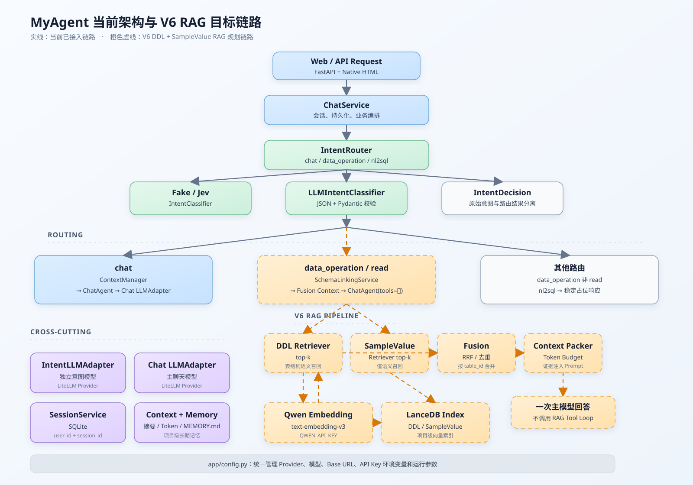

# MyAgent

MyAgent 是一个用于学习 Agentic Chat 架构的 Python 项目。当前项目提供基于 FastAPI 的多轮对话接口，并将模型调用、工具调用、会话上下文和长期记忆拆分为独立模块。

## 已实现能力

- 提供 `POST /api/v1/chat` 多轮聊天接口和简单网页入口。
- 按 `user_id + session_id` 隔离会话，持久化用户消息、助手消息、工具事件、会话摘要和模型用量。
- 通过 `ChatAgent` 实现轻量 Agent Loop：模型可请求工具，后端执行工具后将结果回填给模型，再获取最终回答。
- 通过 `ToolRegistry` 管理工具白名单；当前已接入 `search_schema` 工具。
- 对 `data_operation/read` 使用 DDL 与脱敏 SampleValue 的双路向量召回；默认 Catalog 只建立 DDL 索引，RAG 只提供 Schema 证据，不执行 SQL。
- SampleValue 仅接受外部明确提供的样例；敏感字段和值、低相似度候选会被过滤，歧义候选返回确认提示，Schema 证据无法安全放入上下文预算时接口返回 `413`。
- `nl2sql` 使用 LangGraph 编排 `SchemaLinking → ContextPrepare → GenSQL → ValidateSQL → Execute → Reflection → Output`；GenSQL 和 Reflection 均复用现有 `LLMAdapter.complete(messages, tools=[])`，Reflection 的短原因会回传到下一次 GenSQL。
- NL2SQL 复用会话 ContextManager，因此同一 `user_id + session_id` 的近期消息、摘要、`MEMORY.md`、Token 预算和用量记录都会进入图；主回答完成后才持久化本轮长期记忆。
- NL2SQL 仅允许白名单表/列上的单条只读 `SELECT/WITH`，拒绝 `SELECT *` 与 `table.*`，但允许 `COUNT(*)` 等不返回全部字段的聚合；SQLGlot AST 校验、行数、列数、超时和反思次数均受限。默认未配置、不可用或未启用的业务数据库返回明确 `503`，不会使用聊天会话 SQLite。
- NL2SQL 自动化测试使用 Fake LLM、Fake Executor 或临时 SQLite 文件，不调用真实模型、Embedding 或业务数据库。
- 使用 LiteLLM 接入 OpenAI、DeepSeek、Qwen 三类模型，并保留可注入的 Fake LLM 测试方式。
- 使用滑动窗口、会话摘要、Token 估算和 `MEMORY.md` 管理会话上下文与长期项目记忆。

## V4 意图识别

- 在现有聊天入口前增加 `chat`、`data_operation`、`nl2sql` 三类意图识别。
- `data_operation` 携带 `read`、`create`、`update`、`delete` 或 `unknown` 预留动作字段；当前数据类意图只返回稳定占位响应。
- 通过 `INTENT_PROVIDER` 切换 `fake`、`llm` 和 `jev` 分类器，三者统一输出 `IntentDecision`。
- `llm` 分类器使用独立的意图 LLMAdapter，要求 JSON 输出并经过 Pydantic 校验；主聊天模型与意图模型可以使用不同 Provider，低置信度或非法分类结果路由到普通聊天。
- `jev` 分类器使用官方 `typesafe-sdk`，固定模型为 `typesafe/jev-1.13`，只从 `TYPESAFE_API_KEY` 读取密钥。
- 每次分类保留原始 provider、模型、意图、置信度、延迟和 Token 用量；低置信度只改变实际路由，并提供 `GET /api/v1/intent-metrics` 双口径指标接口。

PowerShell 配置示例：

```powershell
$env:INTENT_PROVIDER = "llm"
$env:INTENT_LLM_PROVIDER = "deepseek"
$env:DEEPSEEK_API_KEY = "<your-intent-key>"
```

未设置 `INTENT_LLM_PROVIDER` 时，意图模型默认跟随 `LLM_PROVIDER`，但仍会创建独立实例；Jev 分类器只读取官方 `TYPESAFE_API_KEY`。

可使用固定评测样本运行分类指标汇总：

```powershell
$env:INTENT_PROVIDER = "fake"
.\.venv\Scripts\python.exe -m app.evaluation.intent_benchmark
```

Fake 仅用于测试与评测链路验证，评测报告标记为 `fixture`，不作为 Jev 或普通 LLM 的准确率比较基线。Jev 的自动化测试使用 mock 客户端，不访问在线服务；实际在线调用需要自行配置 `TYPESAFE_API_KEY`。

## 架构概览



图从上到下展示请求入口、意图路由、三条业务分支和共享基础设施；下方分别展开 V6 RAG 与 V7 NL2SQL 图。`data_operation/read` 通过 SchemaLinkingService 完成 DDL/SampleValue 双路召回、RRF 融合和上下文打包，再以 `tools=[]` 交由 ChatAgent 一次回答；`nl2sql` 在 SchemaLinking 后先执行 ContextPrepare，并只通过校验后的专用只读 SQLExecutor 访问业务库。

## 配置位置

所有运行时环境变量名称、默认 Provider、默认模型和读取逻辑集中维护在 `app/config.py`。业务模块和工厂不直接读取环境变量；真实 API Key 只能设置在系统环境变量或当前 PowerShell 会话中，不能写入 `app/config.py`、README、测试或 Git。

当前配置项：

| 环境变量 | 用途 |
| --- | --- |
| `LLM_PROVIDER` | 主聊天模型 Provider，默认 `qwen`。 |
| `OPENAI_API_KEY` | OpenAI 主聊天模型 API Key。 |
| `DEEPSEEK_API_KEY` | DeepSeek 主聊天模型 API Key。 |
| `QWEN_API_KEY` | Qwen 主聊天模型 API Key。 |
| `INTENT_PROVIDER` | 意图分类器 Provider，默认 `llm`，可选 `fake`、`llm`、`jev`。 |
| `INTENT_LLM_PROVIDER` | 意图模型 Provider；仅 `INTENT_PROVIDER=llm` 时生效，未配置时跟随 `LLM_PROVIDER`。 |
| `TYPESAFE_API_KEY` | Jev 意图分类器 API Key，仅 `INTENT_PROVIDER=jev` 时使用。 |
| `NL2SQL_ENABLED` | 是否启用 NL2SQL；默认 `true`，支持 `true/false`、`1/0`、`yes/no`。设为 `false` 时 NL2SQL 返回 `503`。 |
| `NL2SQL_DATABASE_URL` | 可选的专用只读 SQLite 业务数据库。支持普通文件路径（如 `D:/data/business.sqlite3`）或 `sqlite:///D:/data/business.sqlite3`；未配置、文件不存在或 URL scheme 非 SQLite 时 NL2SQL 返回 `503`。 |

主聊天和意图模型的默认模型均在 `app/config.py` 的 `LLM_PROVIDER_CONFIGS` 中维护：OpenAI 为 `gpt-4o-mini`，DeepSeek 为 `deepseek-flash`，Qwen 为 `deepseek-v4.1-flash`。各 Provider 的固定 Base URL 也在该文件中维护：DeepSeek 为 `https://api.deepseek.com`，Qwen 为 `https://dashscope.aliyuncs.com/compatible-mode/v1`，OpenAI 使用 LiteLLM 默认地址。
RAG 固定使用 Qwen `text-embedding-v3` 与同一个 `QWEN_API_KEY`；DDL 和 SampleValue 分别索引到本地 LanceDB，融合后的少量证据会计入上下文预算后再交给主聊天模型，不进入 Agent Tool Loop。

## 快速启动

在 PowerShell 中执行：

```powershell
python -m venv .venv
.\.venv\Scripts\Activate.ps1
python -m pip install -r requirements.txt
```

选择模型提供商，并在系统环境变量或当前 PowerShell 会话中配置对应 API Key。以下以 Qwen 为例：

```powershell
$env:LLM_PROVIDER = "qwen"
$env:QWEN_API_KEY = "<your-chat-key>"
$env:INTENT_PROVIDER = "llm"
$env:INTENT_LLM_PROVIDER = "deepseek"
$env:DEEPSEEK_API_KEY = "<your-intent-key>"
$env:NL2SQL_ENABLED = "true"
$env:NL2SQL_DATABASE_URL = "D:/data/business.sqlite3"
uvicorn app.main:app --reload
```

启动后访问 `http://127.0.0.1:8000/`，或调用聊天接口：

```powershell
$body = @{
  user_id = "demo-user"
  message = "查询产量相关的表"
} | ConvertTo-Json

Invoke-RestMethod -Method Post `
  -Uri "http://127.0.0.1:8000/api/v1/chat" `
  -ContentType "application/json" `
  -Body $body
```

模型名称和固定 Base URL 在 `app/config.py` 中维护；API Key 不写入代码或仓库。

## 测试

必须使用项目虚拟环境运行测试：

```powershell
.\.venv\Scripts\python.exe -m pytest -q
```

## 目录说明

```text
app/
  agent/       Agent Loop、LLM 适配器、工具注册表
  api/         FastAPI 路由
  memory/      上下文、摘要、Token 与长期记忆
  services/    聊天请求编排
  storage/     会话持久化与 Schema 元数据目录
  tools/       业务工具
data/          Schema 元数据与本地运行数据库位置
docs/          版本设计与实施文档
tests/         单元测试与 API 测试
web/           简单前端页面
```

## 版本文档

- `docs/v1_minimal-agentic-chat-design.md`：最小 Agentic Chat 设计。
- `docs/v2_llm-adapter-multi-provider.md`：多模型厂商适配。
- `docs/v3_context-token-memory-management.md`：上下文、Token 与长期记忆。
- `docs/v4_intent-recognition.md`：意图识别、分类器切换与评测。
- `docs/v4_intent-recognition-fix.md`：原始分类结果、实际路由结果与指标归因修复。
- `docs/v5_intent-routing-llm-adapter-plan.md`：独立意图路由模型 Adapter。
- `docs/v6_rag-ddl-samplevalue-plan.md`：DDL + SampleValue RAG 设计。
- `docs/v7_langgraph-nl2sql-plan.md`：LangGraph 只读 NL2SQL 工作流设计与实施计划。
- `docs/v7_langgraph-nl2sql-fix.md`：LangGraph NL2SQL 的字段白名单、上下文、数据库可用性与状态修复计划。

每次完成一个版本的实现后，同步更新本 README，并将代码、测试和文档一起提交到 GitHub。
